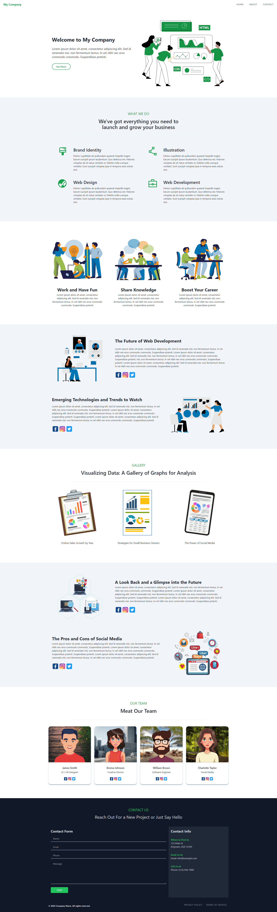

# Single Page Template using Tailwind CSS

The page is designed with a layout using the Tailwind CSS framework. The top of the page features a responsive navigation menu that collapses on smaller screens. Below the menu, there is a prominent header section for the company description that introduces visitors to the company's mission, values, and unique selling points.

On the page, there are several sections for articles. An article includes an image, a headline, a description, and a links to social media.

There is a small gallery with a modal layout that pops up on click, providing visitors with an engaging way to view images in detail. The gallery is designed to showcase the company's products or services or other relevant visuals.

The page also includes a section for team members, with name and brief descriptions of each team member's role and expertise. This section helps visitors get to know the people behind the company and build trust in the brand.

At the bottom of the page, there is a footer with the company's contact information and a simple form that visitors can use to get in touch with any questions or inquiries they may have. The form can include fields for name, email, phone number, and a message. 

---

